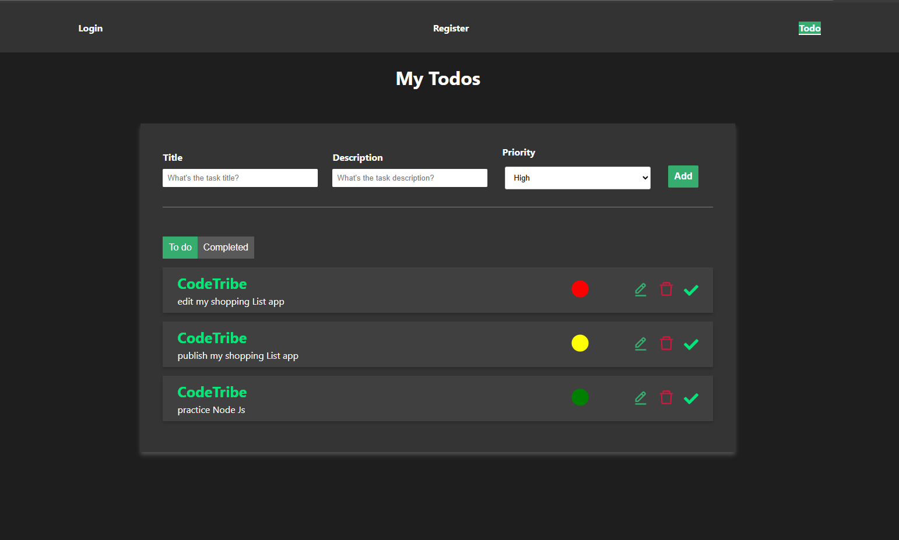
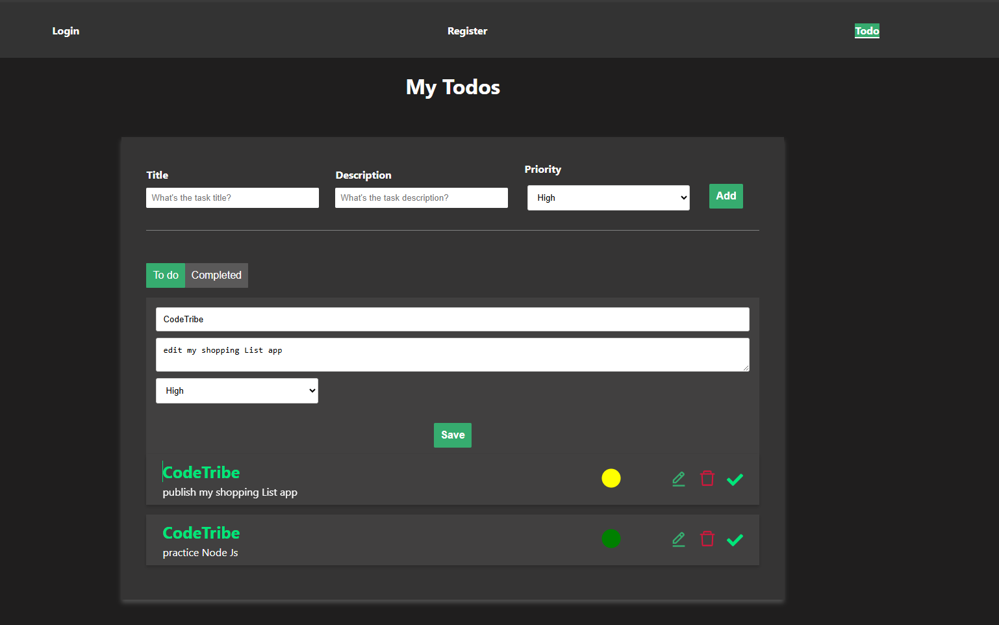
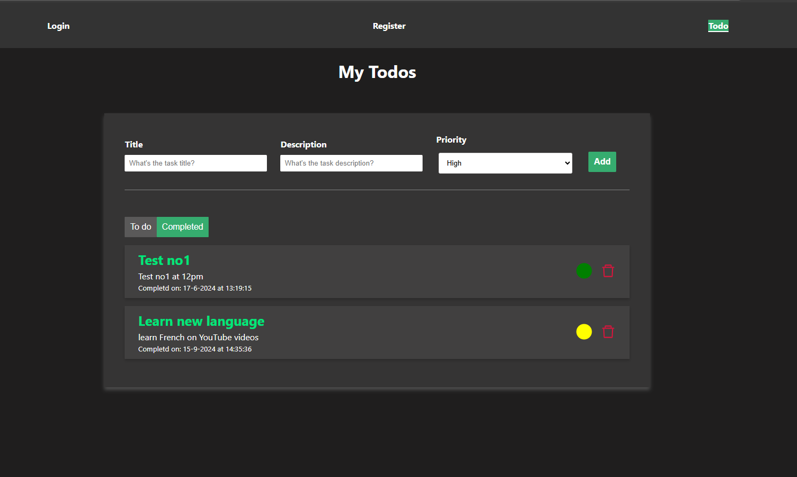

# To-Do List Application

This is a **To-Do List App** built using **React.js** and **CSS**, with **LocalStorage** for persisting task data across browser sessions. The app allows users to manage their daily tasks with full CRUD functionality, categorize tasks by priority, and mark tasks as completed. Completed tasks are stored separately and can be viewed in a dedicated tab.

## Features

### User Features:
1. **Home Page (To-Do List):**
   - Displays a list of tasks, each showing:
     - Task title.
     - Description.
     - Priority rank (color-coded: green for low, yellow for medium, red for high).
     - Action buttons to edit, delete, or mark the task as completed.

2. **Add Task Form:**
   - Inputs for:
     - Task title.
     - Task description.
     - Priority rank selection (Low, Medium, High).
   - Button to add the task to the to-do list.
   - Validation for required fields.

3. **Edit Task Page:**
   - Pre-filled form with the selected task's details.
   - Allows the user to update:
     - Task title.
     - Description.
     - Priority rank (Low, Medium, High).
   - Button to save changes.

4. **Completed Tasks Page:**
   - Separate tab where users can view all tasks marked as completed.
   - Displays completed tasks in the same format as the to-do list.

5. **Delete Task Confirmation:**
   - Confirmation popup when attempting to delete a task.
   - Button to confirm deletion.

6. **Task Priority Color Classification:**
   - Low priority tasks are displayed with a **green** background.
   - Medium priority tasks are displayed with a **yellow** background.
   - High priority tasks are displayed with a **red** background.

7. **LocalStorage Integration:**
   - All tasks (to-do and completed) are stored in the browser's LocalStorage.
   - Tasks persist even after refreshing the browser or reopening the app.

### Navigation Bar:
- **Links:**
  - To-Do List (Displays the list of tasks to complete).
  - Completed Tasks (Displays the list of completed tasks).
  - Add Task (Form to add a new task).
  - Reset (Clears all tasks).

## Technology Stack
- **Frontend:** React.js
- **Styling:** CSS
- **Data Persistence:** LocalStorage (for storing tasks)

## Images





## Installation

To run this project locally, follow these steps:

1. Clone the repository:
   ```bash
   git clone https://github.com/Portia-Nelly-Mashaba/react-js---TodoList
   ```

2. Install the dependencies:
   ```bash
   cd react-js---TodoList
   npm install
   ```

3. Start the React development server:
   ```bash
   npm start
   ```

4. Open the app in your browser:
   ```
   http://localhost:3000
   ```

